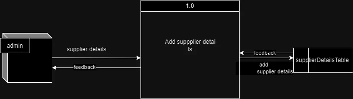
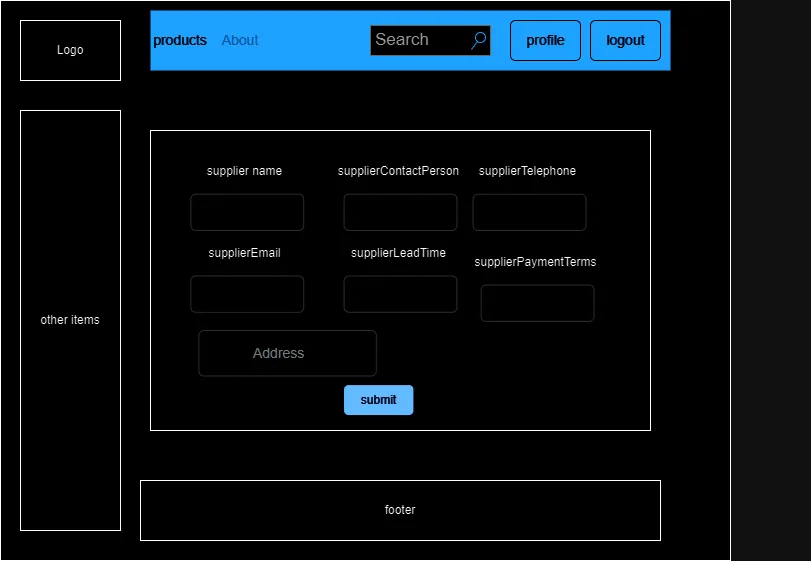

# supplier details Data Flow

1) **ID**:
2) **Name**: Add Supplier Details
3) **Data flow description**: Takes supplier details from the user interface and sends them for processing
4) **source**: Admin
5) **Destination**: process 1.0
6) **Type of data flow**: Form details
7) **Data structure traveling with the flow**: supplier details
8) **Volume/Time**: 10/hour

## comments

- record details for a single supplier

### Data Structure

- supplierDetails = SupplierID +
                    SupplierName +
                    SupplierContactPerson +
                    SuplierTelephone +
                    SupplierEmail +
                    SupplierAddress +
                    SupplyLeadTime +
                    PaymentTerms varchar(50)

supplierContactPerson = SupplierContactPersonFirstName + supplierContactPersonSecondName

### Data Elements

1) **SupplierID**
    description: - This will be autogenerated from the database.
    length: 30
    not null;

2) suppplierName varchar(40)
3) ....

## Data store description form

1) ID :
2) Name: supplierDetails
3) Description: holds the suppliers info

## wireframe

